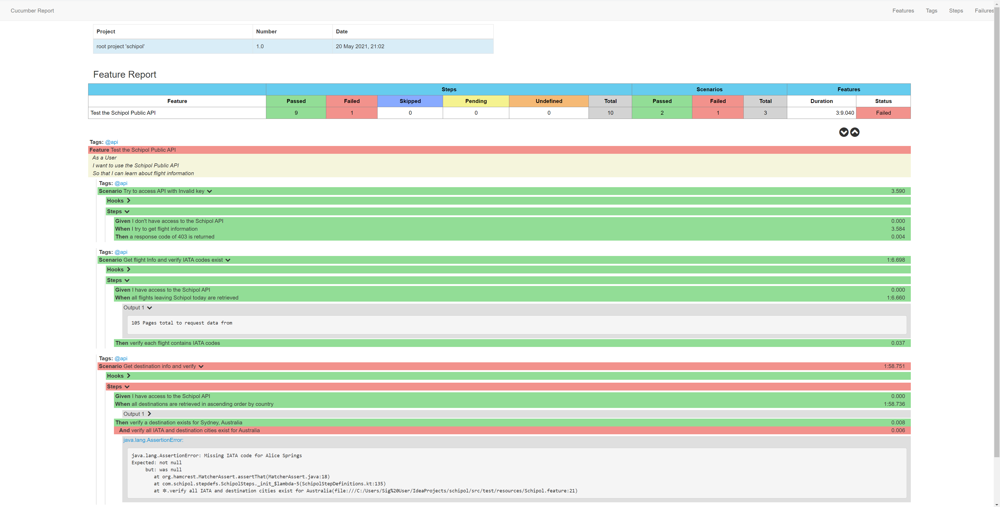

# Description
This project aims to test the Schiphol API as outlined in the [Test Requirements](testRequirements.txt)

The framework used is Cucumber JVM with Kotlin. [Rest Assured](https://rest-assured.io/) is used to build and execute 
the API requests.

Cucumber allows tests to be written using Behaviour Driven Development (BDD). This means that the tests are broken down 
into logical steps that map to a behaviour. Steps are written in English and map to relevant code for that step.
More information can be found here [Automation Panda - Cucumber for Java](https://automationpanda.com/2017/10/24/cucumber-jvm-for-java/#:~:text=Cucumber%20is%20an%20open%2Dsource,framework%20for%20behavior%2Ddriven%20development.&text=Cucumber%2DJVM%20is%20the%20official,using%20annotations%20and%20regular%20expressions.)


### Readability
Cucumber and the BDD style of testing allows reading a test as if it were a little story. It presents tests in a 
human-readable format which makes it very easy to understand what is happening.

```
# Comment
@tag
Feature: Eating too many cucumbers may not be good for you

  Scenario:
    Given Alice is hungry
    When she eats 3 cucumbers 
    Then she will be full
```

### Maintainability
As the tests are self explanatory, it means they can be used as living documentation, which in turn means there is much 
less chance of documentation and implementation getting out of sync. 

As tests are broken up into the various steps it makes it very easy to break code down into smaller chunks and focus on
a specific task, rather than methods that span 100's of lines. 

### Validation
[Hamcrest matchers](http://hamcrest.org/JavaHamcrest/tutorial) are used throughout my tests and are very powerful for asserting data is correct.
They are easy to read but provide simple ways to assert on objects and within data structures.
```
assertThat(theBiscuit, equalTo(myBiscuit)); 
assertThat(theBiscuit, is(equalTo(myBiscuit))); 
assertThat(theBiscuit, is(myBiscuit));

assertThat(map, hasEntry(is("one"),
                           containsInAnyOrder(hasProperty("name", is("one")),
                                              hasProperty("name", is("1")))));
```

### Reporting
Cucumber's out of the box reporting is very limited and, in my opinion, kind of ugly. I have added a different [cucumber reporting tool](https://github.com/damianszczepanik/cucumber-reporting)
which takes the Cucumber test output and generates a slightly prettier version. 



# General Comments
The Schiphol public API is very limited in terms of searching for specific data.
In order to search for specific destinations, flights etc it requires retrieving all the data.
The limited entries returned per page (the docs specify 20 but in some cases higher) requires multiple calls to
be made to get the full dataset of results.
This has caused the tests to run very slowly and inefficiently as the full response dataset is needed.

# Suggested Improvements
## Api 
I have written the tests as they have been asked for in the [Test Requirements](testRequirements.txt) but if I were 
working on the team developing the API I would ask for the following to allow more efficient testing and to give 
consumers of the API a better experience:
- More search parameters. For example, search by country rather than just sort. 
- Ability to specify number of records returned per page. If returning the full dataset is not an option then this could 
  significantly reduce the number of calls needed to retrieve all data
  
## Tests
If changes to the API aren't possible then I would try to improve the tests themselves.
- Efficiency: 
  - Where possible, I would adopt a fail fast approach. To do this I would check each response page for the 
  condition to be met, and as soon as I find what I'm looking for, break the loop to stop making unnecessary requests.
  - This would also prevent creating large datasets that could take a long time to search. 
- Reporting:
  - I have implemented a "Pretty" cucumber reporting tool which is nice to look at, but limited in the information it 
  shows. A better tool to integrate with could be Allure, but was not possible in the limited time.
- Logging: 
  - If I had more time, I would try to log more to the reports. There is a way to add custom logging to Rest 
  Assured requests and responses which would be nice to have in the test reports for visibility.


# Steps to run
1. Open a terminal and navigate to a directory to clone the project
2. `git clone https://github.com/aimeejones123/SchipholAPICucumberKotlin.git`
3. Open the project in intellij.
4. It should automatically start downloading dependencies and building. 
   - If it doesn't, open the Gradle pane on the right-hand side of the application. Navigate: Tasks > build and click 
     `build`. (It will say build `failed for task :test`, this can be ignored)
5. To run the cucumber tests, navigate to Tasks > other and run the `cucumber` task.
   - Note: 1 test will fail which will cause cucumber to fail with exit code 1. This is normal behaviour.
6. Generate the cucumber report by navigating to Tasks > cucumber reports and run the `generateCucumberReports` task
    - A html report will be stored in build/test-report
